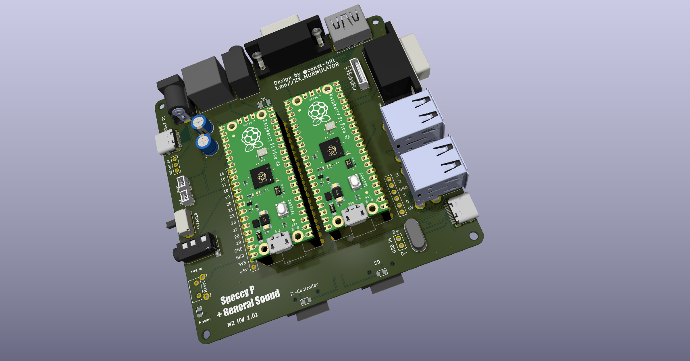
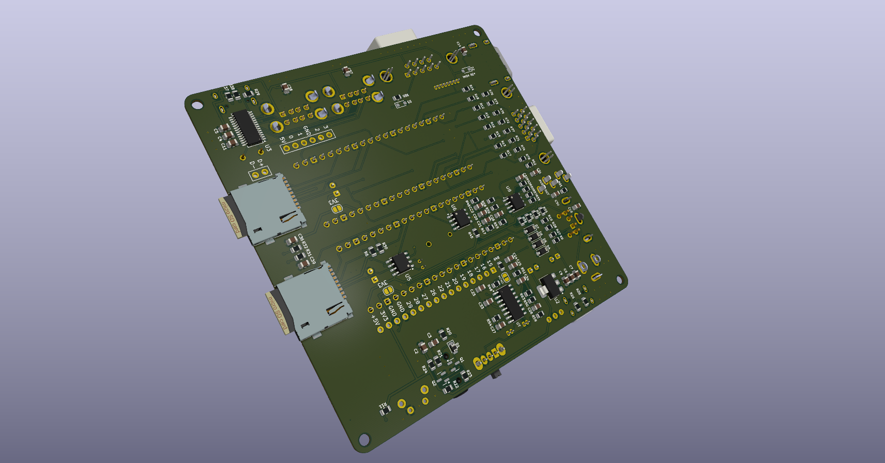

# PCB_SpeccyP_GSP
SpeccyP + GeneralSound (GSP)  two RP2350 

## ⚙️ PCB design for SpeccyP with General Sound on two RP2350 or RP2040 + RP2350 

https://github.com/billgilbert7000/SpeccyP

The board has not been tested yet!

P.S. The GSP [General Sound Pico](https://github.com/billgilbert7000/GeneralSoundPico_SpeccyP)

## 🙏 Many thanks to Mikhail Matveev for the basis of the project!!! 
https://github.com/rh1tech/frank

## ⚙️ Проект печатной платы для SpeccyP с General Sound  на двух RP2350 или RP2040 + RP2350 

https://github.com/billgilbert7000/SpeccyP

Плата ещё не тестировалась! 

P.S. Код GSP [General Sound Pico](https://github.com/billgilbert7000/GeneralSoundPico_SpeccyP)

## 🙏 Огромное спасибо Михаилу Матвееву за основу проекта!!! 
https://github.com/rh1tech/frank

  
   
  <em>SpeccyP GSP top</em>

  
   
  <em>SpeccyP GSP bottom</em>

